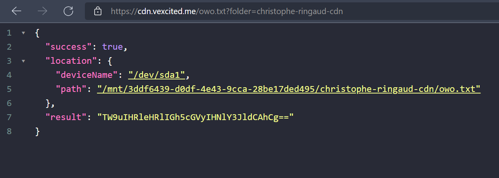

# Express Disk CDN

> Make any external disk, a CDN with the power of an API made with Express.

With this, you can turn any hard drive, usb, etc.. to a CDN.



## Installation

```bash
# Make sure you have Node.js and Yarn installed.
node -v
yarn -v

# Clone this repository.
git clone https://github.com/Vexcited/express-disk-cdn

# Go into the project folder.
cd express-disk-cdn

# Install dependencies.
yarn

# Start the CDN server and pass as argument, the device to be used as CDN.
# Here, my external hard drive is /dev/sda1.
# You can know it by running `lsblk`
yarn start /dev/sda1
```

## Usage

The API is configured to run on `0.0.0.0:8090` by default. You can change it by running the port argument.

```bash
yarn start /dev/sda1 --port 4050
```